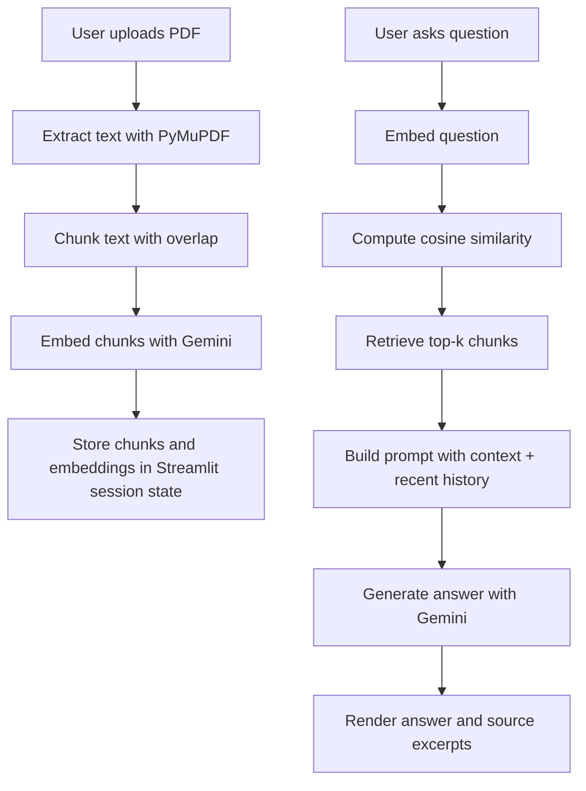

# PDF Q&A RAG System

## Live Demo

[Open the demo App](https://pdf-qna-rag-khawajaibrahimsalim1.streamlit.app/)

[My GitHub Profile](https://github.com/KhawajaIbrahimsalim) · [My LinkedIn Profile](https://www.linkedin.com/in/khawajaibrahimsalim1/)

An end-to-end Retrieval-Augmented Generation application for asking grounded questions over arbitrary PDF documents. The app is built with Streamlit, uses Gemini for embeddings and answer generation, and exposes its retrieval reasoning through source excerpts rather than hiding the model behind a black box.

This project is intentionally simple in deployment and explicit in behavior:

- no vector database
- no background workers
- no opaque orchestration layer
- just a clean RAG pipeline with session-scoped state, transparent retrieval, and a UI that makes the system easy to inspect

## Why This Project Matters

Most document chat demos stop at "upload a file and get an answer." This project goes a step further by making the retrieval pipeline visible and understandable:

- PDF text is extracted page by page
- text is chunked with overlap to reduce boundary loss
- chunks are embedded once and held in memory for the active session
- each question is embedded and matched against the indexed chunks with cosine similarity
- the final response is generated from retrieved context plus short conversation history
- the UI shows the actual supporting excerpts and their relevance scores

That combination makes the app useful both as a portfolio project and as a compact reference implementation of a practical RAG workflow.

## What The App Does

The system allows a user to:

- upload a PDF
- index the document on demand
- ask follow-up questions in a chat interface
- see the retrieved supporting excerpts behind each answer
- reset the session and start over with a new document

The current implementation is optimized for clarity and iteration speed, which makes it especially good for demos, interviews, learning, and first-pass product validation.

## System Architecture



## Design Decisions

### 1. In-memory indexing instead of a vector database

This app stores chunks and embeddings in `st.session_state` rather than in Pinecone, FAISS, Chroma, or PostgreSQL. That is a deliberate tradeoff:

- faster to understand
- easier to deploy
- ideal for a single-user session
- sufficient for interview and portfolio scenarios

The tradeoff is that indexing is ephemeral and resets when the session is cleared or restarted.

### 2. Overlapping chunking

Chunks are built at the word level with overlap. This helps preserve meaning around section boundaries where a naive split would often break context in the middle of an important sentence or explanation.

### 3. Retrieval transparency

The app returns source excerpts with similarity scores so the user can inspect why the answer was generated. This is one of the most important habits in LLM application design: do not ask users to trust the model blindly when you can expose the grounding evidence.

### 4. Short conversation memory

The system includes the last few turns of conversation when generating the next answer. That gives the app better follow-up behavior without pretending it has infinite memory.

## Core Components

### [app.py](d:/Articficial%20Intelligance/protfolio_projects_env/pdf-qna-rag/app.py)

Owns the Streamlit experience:

- page setup
- upload flow
- indexing trigger
- session state management
- chat rendering
- source excerpt display

### [rag_pipeline.py](d:/Articficial%20Intelligance/protfolio_projects_env/pdf-qna-rag/rag_pipeline.py)

Owns the RAG logic:

- PDF parsing
- chunking
- embedding generation
- cosine similarity retrieval
- prompt construction
- answer generation with Gemini

## Current Credential Setup

The current code reads the Gemini key from Streamlit secrets:

```python
api_key = st.secrets["GEMINI_API_KEY"]
```

That means:

- `GEMINI_API_KEY` is the active secret name
- local development should use `.streamlit/secrets.toml`
- Streamlit Community Cloud should use `App Settings > Secrets`
- `config.env` is not the active credential source in the current implementation

## Local Setup

### 1. Clone the repository

```bash
git clone https://github.com/KhawajaIbrahimsalim/pdf-qna-rag.git
cd pdf-qna-rag
```

### 2. Create a virtual environment

```bash
python -m venv venv
```

### 3. Activate it

Windows:

```bash
venv\Scripts\activate
```

macOS/Linux:

```bash
source venv/bin/activate
```

### 4. Install dependencies

```bash
pip install -r requirements.txt
```

### 5. Create `.streamlit/secrets.toml`

```toml
GEMINI_API_KEY = "your_gemini_api_key_here"
```

### 6. Run the app

```bash
streamlit run app.py
```

## Streamlit Cloud Deployment

To deploy on Streamlit Community Cloud:

1. Connect the GitHub repository
2. Set the app entrypoint to `app.py`
3. Open `App Settings > Secrets`
4. Add:

```toml
GEMINI_API_KEY = "your_gemini_api_key_here"
```

The current version of the app expects that secret to exist at startup. If it is missing, the app will fail fast rather than silently degrade.

## User Experience

### Left Sidebar

The sidebar is the document control plane. It handles file upload, indexing, session summary, and reset behavior.

- upload a PDF
- index the current document
- inspect chunk count
- inspect memory state
- clear the active session


### Main Chat Area

The main area is where retrieval becomes visible. It shows the user question, the generated answer, and the retrieved excerpts that supported the answer.

- conversational Q&A over the active PDF
- source excerpts behind each answer
- relevance scores for retrieved chunks
- short multi-turn context retention


## Retrieval Flow

For each question, the pipeline does the following:

1. embed the user question
2. compare it against stored chunk embeddings
3. rank chunks by cosine similarity
4. select the top `k=4` chunks
5. build a prompt from:
   - system instructions
   - retrieved document context
   - recent chat history
   - current user question
6. generate the answer with `gemini-2.5-flash`

This design keeps the model grounded in document evidence while still allowing useful follow-up responses.

## Strengths

- compact, readable RAG implementation
- transparent retrieval UX
- clear separation between UI and pipeline logic
- good portfolio signal for LLM application engineering
- fast to run and easy to explain in interviews

## Known Limitations

- indexing is session-scoped and not persistent
- scanned PDFs without selectable text will not perform well because there is no OCR step
- there is no vector database or long-term document store
- there is no authentication or multi-user isolation
- retrieval is dense-only and does not combine keyword or reranking strategies

These are reasonable limitations for a portfolio-grade MVP, and they also define a natural roadmap for future iterations.

## Suggested Next Steps

If this were extended toward production, the next improvements would likely be:

- persistent vector storage
- OCR support for scanned PDFs
- hybrid retrieval with lexical plus semantic ranking
- answer citation formatting at the page level
- document caching
- multi-document search
- evaluation harnesses for retrieval and answer quality

## Project Structure

```text
pdf-qna-rag/
├── app.py
├── rag_pipeline.py
├── requirements.txt
├── README.md
├── config.env
├── LICENSE
└── assets/
    └── readme/
        ├── Left Side Bar.png
        └── Main Chat Area.png
```

## License

MIT License. See [LICENSE](LICENSE).

## Author

Khawaja Ibrahim Salim

- Email: ibrahimsalim.dev@gmail.com
